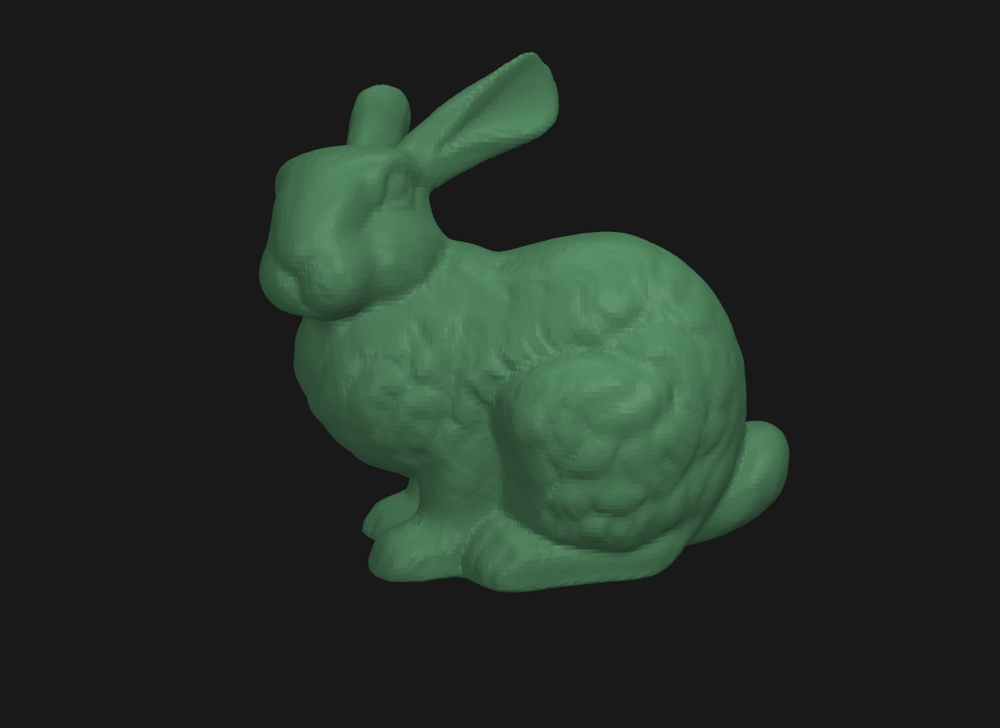

# Mesh Simplification

An implementation of Surface Simplification using Quadric Error Metrics in Vulkan and C++.

## Introduction

In computer graphics, working with highly complex models can degrade rendering performance. One technique to mitigate this situation is to simplify a model by reducing its constituent triangles. This project presents an efficient algorithm to achieve this based on a research paper by Garland-Heckbert titled [Surface Simplification Using Quadric Error Metrics](docs/surface_simplification.pdf).

The central idea of the algorithm is to iteratively remove edges in the mesh through a process known as [edge contraction](https://en.wikipedia.org/wiki/Edge_contraction) which merges the vertices at an edge's endpoints into a new vertex that optimally preserves the original shape of the mesh. This vertex position can be solved for analytically by minimizing the squared distance between it and adjacent triangle faces affected by the edge contraction. With this error metric, edges can be efficiently processed using a priority queue to sort edges by lowest cost until the mesh is sufficiently simplified. To facilitate the implementation of this algorithm, a data structure known as a [half-edge mesh](src/geometry/half_edge_mesh.h) is employed to efficiently traverse and modify edges in the mesh.

## Results

The following GIF presents a real-time demonstration of successive applications of mesh simplification on a polygon mesh consisting of nearly 70,000 triangles. At each iteration, the number of triangles is reduced by 50% eventually reducing to a mesh consisting of only 1,086 triangles (a 98.5% reduction). Note that although fidelity is reduced at each step, the mesh retains an overall high-quality appearance that nicely approximates the original shape of the mesh.



## Requirements

This project requires CMake 3.27 and a compiler that supports the C++23 language standard. To assist with CMake configuration, building, and testing, [CMake Presets](https://cmake.org/cmake/help/v3.22/manual/cmake-presets.7.html) are used with [ninja](https://ninja-build.org/) as a build generator.

### Vulkan

This project requires a graphics driver with Vulkan 1.3 support. While not required for release builds, this project requires the [Vulkan SDK](https://www.lunarg.com/vulkan-sdk/) for debug builds which enable [validation layers](https://vulkan.lunarg.com/doc/view/latest/windows/validation_layers.html) by default.

### Package Management

This project uses [`vcpkg`](https://vcpkg.io) to manage external dependencies.  To get started, run `git submodule update --init` to clone `vcpkg` as a git submodule. Upon completion, CMake will integrate with `vcpkg` to download, compile, and link external libraries specified in the [vcpkg.json](vcpkg.json) manifest when building the project.

### Address Sanitizer

This project enables [Address Sanitizer](https://clang.llvm.org/docs/AddressSanitizer.html) (ASan) for debug builds. On Linux, this should already be available when using a version of GCC or Clang with C++23 support. On Windows, ASan needs to be installed separately which is documented [here](https://learn.microsoft.com/en-us/cpp/sanitizers/asan?view=msvc-170#install-addresssanitizer).

## Build

The simplest way to build the project is to use an IDE with CMake integration. Alternatively, the project can be built from the command line using CMake presets. To use the `windows-release` preset, run:

```bash
cmake --preset windows-release
cmake --build --preset windows-release
```

A list of available configuration and build presets can be displayed by running  `cmake --list-presets` and `cmake --build --list-presets` respectively. At this time, only x64 builds are supported. Note that on Windows, `cl` and `ninja` are expected to be available in your environment path which are available by default when using the Developer Command Prompt for Visual Studio.

## Test

This project uses [Google Test](https://github.com/google/googletest) for unit testing which can be run after building the project with [CTest](https://cmake.org/cmake/help/book/mastering-cmake/chapter/Testing%20With%20CMake%20and%20CTest.html). To use the `windows-release` preset, run:

```bash
ctest --preset windows-release
```

To see what test presets are available, run `ctest --list-presets`.  Alternatively, tests can be run from the separate `tests` executable which is built with the project.

## Run

The program executable can be found in the `out/build/<preset>/src` directory. Once running, the mesh can be simplified by pressing the `S` key. The mesh can also be viewed from different angles by left clicking and dragging the cursor across the screen.
